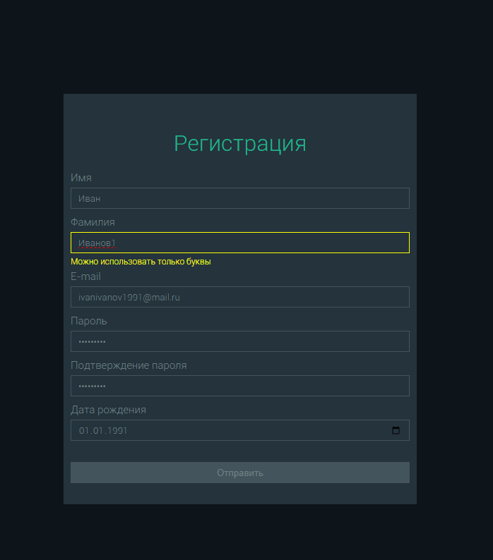

[Тестовое задание](https://cloud.mail.ru/public/KN2F/TW4dPYs6n)

## Пояснения по выполнению задания

1. В качестве ограничения на максимальную длину имени было выделено 40 знаков по нескольким причинам:

- Существование очень длинных имен (Абдурахмангаджи)
- Возможность брать двойное имя (Александра-Валерия)

  Аналогично для фамилии.

2. В качестве события для срабатывания валидации для полей ввода было выбрано событие 'input', так как оно позволяет сразу проверять валидность данных не делая дополнительный клик для потери полем фокуса.

## Форма регистрации

## Валидная форма регистрации

## Не валидная форма регистрации

